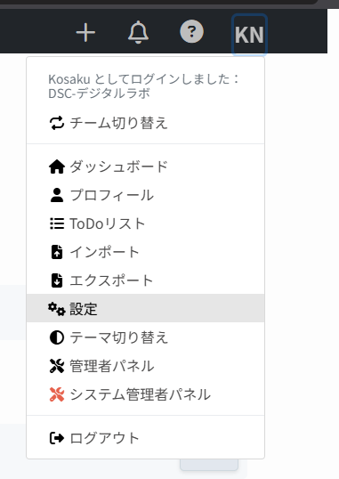
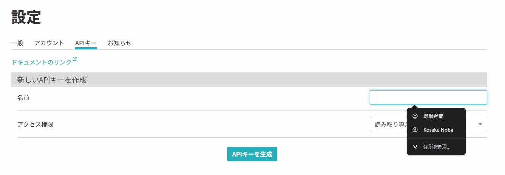
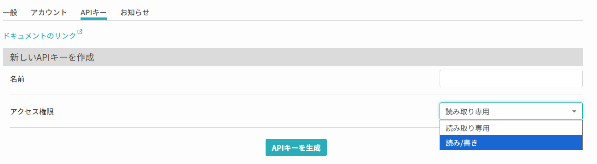
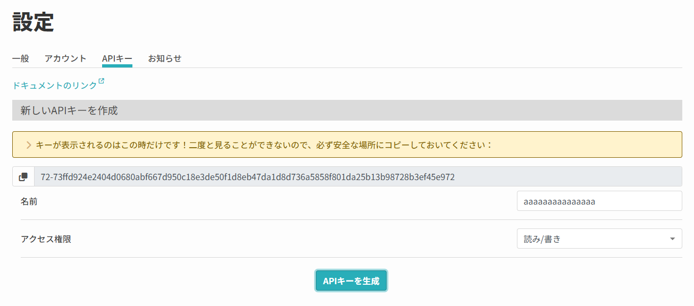

# elab-doc-sync

Markdown ドキュメントを eLabFTW に同期する CLI ツール。`esync` エイリアスでも使えます。

## これは何？

ローカルの Markdown ファイルを eLabFTW のリソースや実験ノートとして管理するツールです。普段使い慣れたエディタで書いて、コマンド一発で eLabFTW に反映できます。

## 1.0で変わること

通常のpullはローカル未編集の文書を更新し、両側に変更がある場合は競合として停止します。バックアップ・復元、紐付けを保持する `mv`、途中失敗からの再開に対応しました。同期モードは `each` のみです。

既存ユーザーは更新前に [v1.0への移行と復旧](docs/13_MIGRATION_V1.md) を確認してください。検証環境・結果は [リリース検証](docs/14_RELEASE_VALIDATION.md) に記載しています。

---

## まず使えるようにする（初回セットアップ）

### 必要なもの

- Python 3.10 以上
- [uv](https://docs.astral.sh/uv/)

### インストール

```bash
uv tool install --force git+https://github.com/Kosaku-Noba/elab-doc-sync.git
```

### 初期設定（質問に答える）

```bash
esync init
```

```
=== elab-doc-sync セットアップ ===

eLabFTW の URL: https://<eLabFTWへのURL>/
SSL 証明書を検証しますか？ [Y/n]: n
Markdown ファイルを置くディレクトリ（空欄で docs/）:<好きな場所>
同期する Markdown のファイルパターン（空欄で *.md）:
送信先 — items(resources): リソース / experiments: 実験ノート [items]:
送信形式 — md: Markdown のまま / html: HTML に変換 [md]:

```

URL、保存先、送信先を聞かれるので順に答えると `.elab-sync.yaml` が生成されます。

### API キーを設定する

eLabFTW → ユーザー設定 → API Keys でキーを作成し、`.elab-sync.yaml` に貼る:

#### APIキーの設定場所(elabFTW側)



左上ボタンから設定をクリック



設定内のAPIキーから名前を入力



アクセス権限を読み書きに変更



でてきた文字列をコピー(このときしか出ないので注意)

```yaml
elabftw:
  url: "https://your-elabftw.example.com"
  api_key: "ここにキーを貼る"
  verify_ssl: false
```

あるいは環境変数でもOK:

```bash
export ELABFTW_API_KEY="your_key"
```

### Git管理から除外する

プロジェクトの `.gitignore` に次を追加してください。APIキーや退避した本文の公開を防ぎ、同期・復旧記録を手元に保持します。

```gitignore
.elab-sync.yaml
.elab-sync-ids/
.elab-sync-backups/
.elab-sync-operations/
.elab-sync-recovery.json
```

独自の `id_file` を設定した場合は、その保存先も除外してください。これらの記録は復旧に必要なので、一括削除しないでください。

---

## 日常の使い方

### 書いたものを eLabFTW に送る（push）

```bash
esync
```

変更があるファイルだけ自動で送信されます。変更がなければスキップ:

```bash
$ esync
  [実験メモ] 変更なし（スキップ）
```

### 送信前に確認だけしたい

```bash
esync --dry-run
```

### eLabFTW から最新を取得する（pull）

既に同期済みのファイルを再取得:

```bash
esync pull
```

eLabFTW 上の特定の記事をローカルに持ってくる:

```bash
esync pull --id 42 --entity items
```

- `--id` は eLabFTW の記事番号です（URL の末尾やタイトル横に表示される `#42` のような数字）
- `--entity` は記事の種類です:
  - `items`（= リソース）: 試薬、プロトコル、機器情報など
  - `experiments`（= 実験ノート）: 実験記録

複数まとめて取得:

```bash
esync pull --id 42 --id 43 --id 44 --entity items
```

pull 時、ローカルのどのディレクトリに保存するかは **タグ・カテゴリ・タイトル** から自動判定されます。判定できない場合は対話で聞かれます。

### ローカルと eLabFTW の差分を見る

```bash
esync diff
```

---

### 文書の追跡解除

```bash
esync rm docs/note.md                         # 文書を保持して同期対象から除外
esync rm --id 42 --entity items               # リモート ID で指定
esync rm docs/note.md --local                 # ローカル Markdown も削除
esync rm docs/note.md --local --dry-run       # 実行前に確認
```

リモートのデータは保持します。解除したファイルは今後の push・status の対象から除外されます。複数指定や再登録方法は [CLI リファレンス](docs/05_CLI_REFERENCE.md#rm--追跡解除) を参照してください。

## 応用: こういう場面ではこうする

### eLabFTW にある既存プロジェクトをローカルに持ってきたい

```bash
export ELABFTW_API_KEY="your_key"
esync clone --url https://elab.example.com --entity items --id 42
```

プロジェクトディレクトリ一式が生成されます。

### 週報と実験メモを別ディレクトリで管理したい

`.elab-sync.yaml` でターゲットを分ける:

```yaml
targets:
  - docs_dir: "weekly_reports/"
    mode: each
    entity: items
    tags: ['週報']
    title_pattern: "*週報*"    # pull 時のタイトル自動振り分け

  - docs_dir: "experiments/"
    mode: each
    entity: experiments
```

push 時は各 `docs_dir` から送信され、pull 時はタグやタイトルから適切なディレクトリに自動配置されます。

### 別チームの eLabFTW にも投稿したい（複数 API キー）

プロファイルを追加:

```bash
esync profile add team-b --url https://elab.example.com --api-key "team-b-key"
```

ターゲットごとにプロファイルを指定:

```yaml
targets:
  - docs_dir: "my_docs/"
    profile: default

  - docs_dir: "shared_docs/"
    profile: team-b
    tags: ['共同研究']
```

プロファイル一覧の確認:

```bash
esync profile list
```

### タグやカテゴリを操作したい

```bash
# タグ一覧
esync tag list --id 42 --entity items

# タグ追加
esync tag add "new-tag" --id 42 --entity items

# カテゴリ設定
esync category set "試薬" --id 42 --entity items
```

### リモートに何があるか見たい

```bash
esync list                        # リソース一覧
esync list --entity experiments   # 実験ノート一覧
```

### ファイルを既存のエンティティに手動で紐付けたい

```bash
esync link 42 --file "実験メモ.md"
```

### PDF や CSV も一緒に送りたい（添付ファイル）

```yaml
targets:
  - docs_dir: "docs/"
    attachments_dir: "attachments/"
    entity: items
```

`attachments/` に置いたファイルが push 時に自動アップロードされます。

画像・動画・ファイルリンク・添付の送信対象は、プロジェクト内の通常ファイルに限定します。プロジェクト外への参照、隠しファイル・隠しディレクトリ、シンボリックリンクは拒否します。必要な実体をプロジェクト内の通常ディレクトリへ配置してください。[送信制約と復旧](docs/13_MIGRATION_V1.md#バックアップと復元) も参照してください。

### 数式を使いたい

```yaml
targets:
  - docs_dir: "docs/"
    body_format: md    # ← Markdown のまま送信（MathJax でレンダリング）
```

```markdown
インライン: $E = mc^2$

ブロック:
$$\frac{\partial f}{\partial x} = 2x + 1$$
```

### ファイル間リンクを貼りたい

`each` モードでは、同期済みの `.md` ファイル同士をリンクできます:

```markdown
詳しくは [セットアップガイド](./setup.md) を参照。
```

**push 時**: ローカルリンクが eLabFTW の記事 URL に自動変換されます。

```
[セットアップガイド](./setup.md)
  → [セットアップガイド](https://elab.example.com/items.php?mode=view&id=42)
```

**pull 時**: eLabFTW の記事 URL がローカルリンクに逆変換されます。

**仕様:**
- 対象: `.md` ファイルへのリンクのみ（画像、外部URL、アンカーリンクはスキップ）
- リンク先が同期済み（mapping に存在する）場合のみ変換。未同期のリンクはそのまま残る
- フラグメント（`#section`）は保持される

### ファイル名を変える

```bash
esync mv docs/旧タイトル.md docs/新タイトル.md
esync push
```

紐付けを保持して移動し、次のpushでタイトルを更新します。自動検出は本文ハッシュが一致し、対応が一意な場合だけ行います。本文編集も伴う移動は `esync mv` を使ってください。

### 競合を確認・復旧する

```bash
esync status
esync diff
esync pull --dry-run
esync backup list
esync restore <バックアップID> --dry-run
esync restore <バックアップID>
```

通常のpullはローカル未編集の文書を更新します。両側が変更された場合は停止し、ローカルだけの変更は保持します。上書き・削除・移動前にバックアップを保存し、復元直前の状態も退避します。

**復元はバックアップに記録されたディレクトリまたはファイル全体に適用されます。** 保存後に追加したファイルも復元先から取り除かれるため、必ず `restore --dry-run` で範囲を確認してください。バックアップは自動削除されません。不要な世代は復旧不要と確認してから手動で削除できます。

`pull --force` はローカルを退避して上書きします。`push --force` はリモート本文を退避して上書きします。リモート本文の退避データは復元時にJSONへ取り出し、確認後に手動で反映します。

追跡解除した文書は `esync link <ID> --file <ファイル名>` で追跡再開できます。複数ターゲットでは `--target <名前またはdocs_dir>` を指定してください。

`status` はサーバーに接続して状態を確認します。表示に応じて次の操作を選びます。

| 状態 | 対処 |
|---|---|
| 最新 | 操作不要 |
| 送信待ち | `push` でローカルの変更を送る |
| 取得待ち | `pull` でリモートの変更を取得する |
| 競合 / 基準情報なし | `diff` で確認し、採用する側を決めてから `push --force` または `pull --force` |
| リモート削除 | サーバーの削除状態を確認する。強制pushでも再作成しない |
| 確認失敗 | 接続・APIキーを確認して再実行する |

新規作成の応答が失われた場合は、重複作成を避けるため停止します。サーバー上の記事を確認し、存在すれば `link`、存在しないと確認できた場合だけ `link --new --file <ファイル名>` で再開します。

移行・復元範囲・途中失敗の扱いは [v1.0への移行と復旧](docs/13_MIGRATION_V1.md) を参照してください。

---

## pull の自動振り分け

`esync pull --id` で新しいエンティティを取得する際、以下の順で保存先を決定します:

1. **既に紐付け済み** → そのディレクトリへ再同期
2. **ターゲットが1つだけ** → そのターゲットの `docs_dir` へ
3. **複数ターゲット** → タグ/カテゴリ/タイトルでスコアリング
4. **判定できない** → 対話で選択 or `--auto` で最高スコアを採用

スコアリング:

- `title_pattern` (glob) マッチ: +10
- `category` 一致: +10
- `tags` の包含率: 最大 5 + 特異性ボーナス

判定を常に自動で行いたい場合:

```bash
esync pull --id 42 --entity items --auto
```

マッチするターゲットがない場合、リモートのメタデータから新しいターゲットが `.elab-sync.yaml` に自動追記されます。

---

## 同期モード

`each`（1ファイル＝1記事）のみ対応します。旧 `merge` 設定は [移行手順](docs/13_MIGRATION_V1.md#mergeを使っていた場合) に従って変更してください。

---

## コマンド一覧

| コマンド                              | やること                    |
| ------------------------------------- | --------------------------- |
| `esync`                             | push（ローカル → eLabFTW） |
| `esync pull`                        | pull（eLabFTW → ローカル） |
| `esync pull --id 42 --entity items` | 指定 ID を取得              |
| `esync diff`                        | 差分表示                    |
| `esync status`                      | 同期状態を確認              |
| `esync list`                        | リモート一覧                |
| `esync clone`                       | プロジェクトを構築          |
| `esync tag list/add/remove`         | タグ操作                    |
| `esync category list/show/set`      | カテゴリ操作                |
| `esync profile list/add/remove`     | 接続プロファイル管理        |
| `esync link <ID>`                   | 手動紐付け                  |
| `esync rm <ファイルパス>`           | 追跡解除（`--local` でローカルファイルも削除） |
| `esync mv <旧パス> <新パス>` | 文書と紐付けを移動 |
| `esync backup list` | バックアップ一覧 |
| `esync restore <ID>` | ローカル復元・リモート退避データの取り出し |
| `esync verify`                      | 整合性チェック              |
| `esync init`                        | 初期設定                    |
| `esync update`                      | ツール更新                  |
| `esync --dry-run`                   | 実行せず確認                |
| `esync --force`                     | 強制同期                    |
| `esync -t "名前"`                   | 特定ターゲットだけ          |

---

## 設定リファレンス

### 接続設定

```yaml
# 方法1: 従来形式（1サーバー）
elabftw:
  url: "https://elab.example.com"
  api_key: "your_key"
  verify_ssl: true

# 方法2: profiles（複数サーバー/チーム）
profiles:
  default:
    url: "https://elab.example.com"
    api_key: "key-a"
    verify_ssl: true
  team-b:
    url: "https://elab.example.com"
    api_key: "key-b"
    verify_ssl: true
```

環境変数 `ELABFTW_API_KEY` は default プロファイルの api_key を上書きします。

### ターゲット設定

| キー                    | 必須      | デフォルト  | 説明                                               |
| ----------------------- | --------- | ----------- | -------------------------------------------------- |
| `docs_dir`            | ✅        | —          | Markdown ディレクトリ                              |
| `title` | — | 空文字 | CLIでターゲットを指定する名前。記事タイトルはファイル名から決定 |
| `pattern`             | —        | `*.md`    | Glob パターン                                      |
| `mode` | — | `each` | 1ファイル＝1記事 |
| `entity`              | —        | `items`   | `items` / `experiments`                        |
| `profile`             | —        | `default` | 使用する接続プロファイル                           |
| `tags`                | —        | `[]`      | push 時に自動追加するタグ（pull 振り分けにも使用） |
| `category`            | —        | —          | push 時のカテゴリ（pull 振り分けにも使用）         |
| `title_pattern`       | —        | —          | pull 振り分け用タイトル glob                       |
| `body_format`         | —        | `html`    | `md` / `html`                                  |
| `attachments_dir`     | —        | —          | 添付ファイルディレクトリ                           |
| `attachments_pattern` | —        | `*`       | 添付ファイル glob フィルタ                         |

---

## トラブルシューティング

| メッセージ                       | やること                               |
| -------------------------------- | -------------------------------------- |
| `API キーが設定されていません` | `.elab-sync.yaml` の api_key を確認  |
| `設定ファイルが見つかりません` | `esync init` を実行                  |
| `ファイルがありません`         | `docs_dir` に `.md` ファイルを置く |
| タイムアウト | 状態と未完了記録を確認して再実行。記事の作成結果が不明ならlist/linkで確認 |

### `esync update` したのにバージョンが古いまま

**原因**: プロジェクトの `.venv` 内に古い `esync` が残っており、PATH 上で `uv tool` 版より優先されている。

**確認方法** (PowerShell):
```powershell
Get-Command esync | Select-Object -ExpandProperty Source
# .venv\Scripts\esync.exe が表示されたら PATH 優先度の問題
```

**解決方法**:
```powershell
# プロジェクトディレクトリで実行（.venv から孤立パッケージを削除）
uv sync
```

その後、新しいターミナルを開いて `esync --version` で確認。

**防止策**: `elab-doc-sync` をプロジェクトの `pyproject.toml` の dependencies に追加しない（ユーザーツールとして `uv tool` で管理する）。

---

## 開発

検証結果と正式リリース条件は [リリース検証](docs/14_RELEASE_VALIDATION.md) を参照してください。

```bash
git clone https://github.com/Kosaku-Noba/elab-doc-sync.git
cd elab-doc-sync
uv sync --extra test
uv run pytest -q -m "not integration"
```

## ライセンス

MIT
